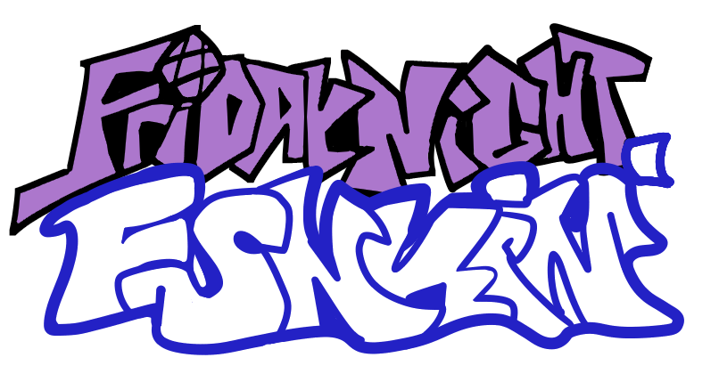
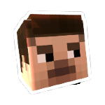
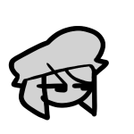

<!--This is the markdown readme. View the pretty format on the webpage:
example.com
-->

___
# Source for Vs Zucco: a mod to Friday Night Funkin'
If you just want to funkin' play Vs Zucco, play it [here](https://example.com).

If you just want to funkin' download Vs Zucco, visit [releases](https://example.com).

If you just want to know what the funk Vs Zucco is, visit the [webpage](https://example.com)!

# Building From Source

## Haxe
You must have [the most up-to-date version of Haxe](https://haxe.org/download/) (4.3.1+) in order to compile.

## Visual Studio / Visual Studio Code

Install [Visual Studio Code](https://code.visualstudio.com/download).

For language support, debugging, linting, and documentation, install the [Vs Haxe Extension Pack](https://marketplace.visualstudio.com/items?itemName=vshaxe.haxe-extension-pack).

For Lime / OpenFL project support, install the [Lime Extension](https://marketplace.visualstudio.com/items?itemName=openfl.lime-vscode-extension).

`windows` For compiling the game on windows, install [Visual Studio 19](https://visualstudio.microsoft.com/vs/older-downloads/#visual-studio-2019-and-other-products) and ONLY these components:
```
MSVC v142 - VS 2019 C++ x64/x86 build tools
Windows SDK (10.0.17763.0)
```

## Command Prompt/Terminal

 These methods send you to a terminal, which will be used to install libraries and compile the game.
 
`windows`
```
Vs Code: View > Terminal 

Start Menu: Click on the Start button, type "PowerShell" or "Command Prompt" in the search bar, and select the respective application from the search results.

File Explorer: Navigate to the desired location and enter "powershell" or "cmd" in the address bar to open with the current location set as the working directory.

Run Dialog: Press the Windows key + R to open the Run dialog, type "powershell" or "cmd", and press Enter.
```

`mac`
```
Vs Code: View > Terminal

Spotlight Search: Press Command + Space to open Spotlight Search, type "Terminal," and press Enter.

Finder: Open the Finder, go to the "Applications" folder, open the "Utilities" folder, and double-click on the "Terminal" application.

Launchpad: Open the Launchpad (icon looks like a rocket in the Dock), type "Terminal" in the search bar, and click on the Terminal app.
```

`linux`
```
Ain't no way I'm compiling the game on every single linux distro. Try stuff out and see!
```

## Haxe Module Manager
To install HMM for installing and managing libraries needed for Vs Zucco, run the following command:
`haxelib install hmm`

To install the libraries listed in hmm.json, run the following command:
`haxelib run hmm install`

## Compilation
Run the correlating commands in the terminal that match your build target to compile.

`windows`
```
lime test windows
lime test windows -debug
lime build windows
```

`linux`
```
lime test linux
lime test linux debug
lime build linux
```

`html5`
``` 
lime test html5
lime test html5 -debug
lime build html5
```

`mac`
```
lime test mac
lime test mac -debug
lime build mac
```

# Credits:

 ©Vs Zucco Team 2024 - Some rights reserved.

Vs Zucco is not an official Funkin' product. Not assosiated with The Funkin' Crew.

## Vs Zucco Team
* name w/hyperlink - contribution
* [It'z_Miles](https://twitter.com/Itz_MilesDev) - Programmer/ParallaxLT 
* github - [contributors](https://github.com) 

## Psych Engine
* Shadow Mario - Programmer/Owner of Psych 
* shubs - New Input System 
* PolybiusProxy - HxCodec Video Support 
* Keoiki - Note Splash Animations 
* github - [contributors](https://github.com/ShadowMario/FNF-PsychEngine/graphs/contributors) 

## Funkin' Crew
* ninjamuffin99 - Programmer of Friday Night Funkin' 
* PhantomArcade -	Animator of Friday Night Funkin' 
* evilsk8r - Artist of Friday Night Funkin' 
* kawaisprite - Composer of Friday Night Funkin' 
* github - [contributors](https://github.com/FunkinCrew/Funkin/graphs/contributors) 

